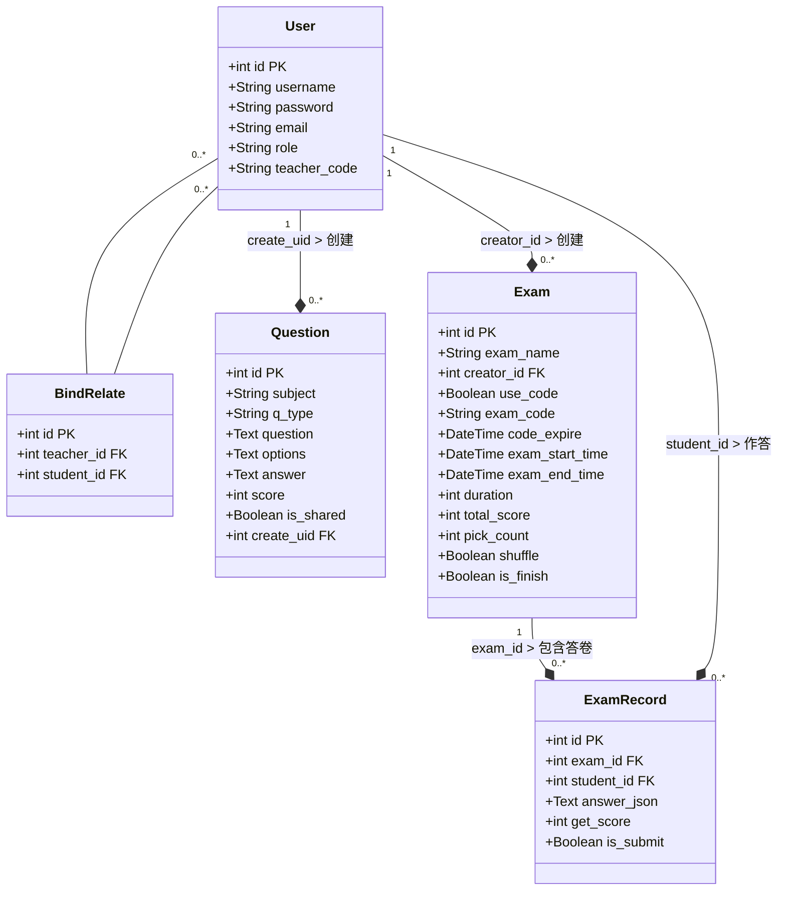
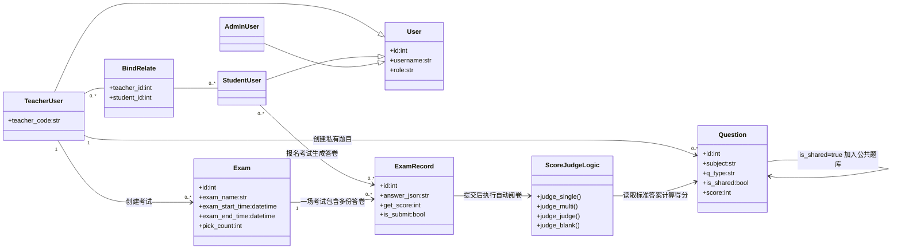
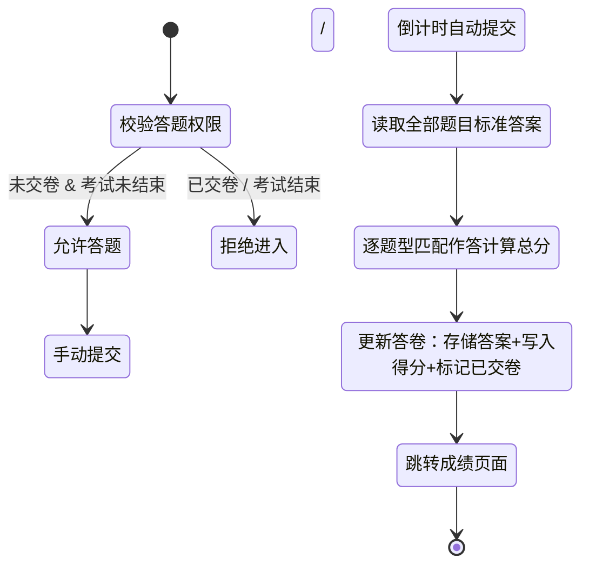

# MiniExamSystem 智能在线考试系统 说明文档
## 一、系统概述
### 1.1 项目简介
MiniExamSystem 是一套基于 Python Flask 开发的轻量化 B/S 架构在线智能考试系统，区分**管理员、教师、学生**三类角色做权限隔离，深度集成通义千问大模型实现 AI 一键自动出题。
系统支持师生绑定、公共共享题库、6位教师身份码/6位考试码双重准入机制、在线计时答题、客观题全自动阅卷、考试历史记录查询等完整教学考核业务。
底层采用 SQLite 文件型数据库，无需部署 MySQL 等数据库服务，开箱即用，适合课堂随堂测验、课后作业、线上单元测试等中小型教学场景。

### 1.2 技术架构
#### 后端技术栈
1. Web 框架：Flask 2.x 轻量 Web 服务框架
2. ORM 数据库：Flask-SQLAlchemy，操作 SQLite 本地文件数据库
3. 表单处理：WTForms，实现表单渲染、输入校验、CSRF 安全防护
4. AI 能力：DashScope 通义千问 API，智能结构化生成各类习题
5. 基础工具库：`json` 序列化、`datetime` 时间计算、`random` 随机码生成
6. 会话管理：Flask Session 存储登录身份，控制页面访问权限

#### 前端技术栈
1. 模板引擎：Jinja2（Flask 内置模板）
2. 页面基础：原生 HTML + CSS + JavaScript
3. 无重型前端框架，轻量化页面，兼容所有主流浏览器

#### 分层架构
1. 表现层：`templates` 页面模板，负责数据展示、用户交互
2. 控制层：`app.py` 全部路由函数，分发请求、调度业务逻辑
3. 业务逻辑层：封装 AI 出题、自动判分、报名校验、模板过滤器等核心工具函数
4. 数据持久层：SQLAlchemy 数据模型，映射数据表，完成增删改查

## 二、核心功能
### 1. 用户角色管理
系统三类角色权限完全隔离，注册时选定身份，功能边界严格区分：
1. **管理员（Admin）**
内置初始账号，系统最高权限，预留用户数据管理、系统清理拓展能力。
2. **教师（Teacher）**
注册自动生成唯一6位数字身份码；可创建考试、AI批量出题、管理私有题库；支持题目共享公共题库；查看绑定自己的全部学生、查看每场考试学生得分。
3. **学生（Student）**
通过教师6位身份码搜索并绑定老师；绑定后免考试码查看该教师全部考试；也可输入考试码参与陌生教师的考试；在线计时答题、自动阅卷、查看全部历史考试与标准答案。

### 2. 题目管理
系统支持5类标准化题型，统一字段存储：
- 单选题：单一选项匹配得分
- 多选题：选项集合完全匹配得分
- 判断题：布尔值对错匹配
- 填空题：文本模糊匹配标准答案
- 简答题：仅保存作答内容，预留人工评分拓展

每条题目存储字段：题干、选项JSON数组、标准答案JSON、分值、创建教师ID、是否共享标记。

### 3. AI 智能出题
对接阿里云通义千问大模型，全自动批量生成习题：
1. 自定义出题主题/知识点（如 Python 循环、初中化学方程式）
2. 自由选择题型、设置单次出题数量（限制 1~20 道）
3. AI 输出标准结构化 JSON，后端自动解析存入教师私有题库
4. 网络异常、密钥失效时弹出友好提示，不会崩溃

### 4. 自动评分系统
学生交卷后后端自动完成客观题阅卷，无需教师手动批改：
1. 逐题比对学生作答与标准答案，按题型规则计算得分
2. 总分自动存入答卷记录，永久保存
3. 学生可随时回看本场考试题干、自己答案、标准参考答案
4. 简答题仅存储作答文本，暂不实现自动判分，支持后续拓展

### 5. 考试码 & 教师身份码 双码机制
1. **教师身份码（6位纯数字）**
每位教师注册自动生成唯一6位数字编码；学生输入身份码即可搜索、绑定对应教师；绑定后无需考试码，直接查看该教师所有考试并报名。
2. **考试码（6位字母+数字混合）**
教师创建考试时可手动开启；系统生成唯一6位准入码；未绑定该教师的学生，可输入考试码单独报名本场考试；支持设置考试码有效截止时间。

### 6. 题库管理
分为「个人私有题库」和「全局公共共享题库」两套资源体系：
1. 私有题库：教师 AI 生成的题目默认私有，仅本人可见、可编辑
2. 批量共享：支持多选题目一键发布至公共题库
3. 公共题库：所有教师均可浏览，支持批量收藏他人题目到自己私有题库
4. 数据隔离：收藏生成独立题目副本，原作者修改不会影响已收藏副本

### 7. 考试全生命周期管理
1. 创建考试：填写考试名称、答题时长、开考时间、随机抽题数量、总分、是否打乱题目、是否启用考试码
2. 自动计算考试结束时间，超时禁止进入答题、强制自动交卷
3. 两种报名渠道：绑定教师免码报名 / 输入考试码报名
4. 答题页面实时倒计时，倒计时结束自动提交试卷
5. 教师后台可查看自己创建的所有考试，以及每场考试全体学生得分

### 8. 安全与权限控制
1. CSRF 表单防护：所有提交表单内置安全令牌，拦截跨站伪造请求
2. 登录态强制校验：所有后台页面校验 Session，未登录自动跳转登录页
3. 越权访问拦截：
   - 学生仅能查看自身答卷、绑定教师
   - 教师仅可操作自己创建的题目、考试
4. 输入规则校验：WTForms 限制账号、密码、6位编码长度，拦截非法输入
5. 会话销毁：登出清空登录 Session，彻底退出权限

## 三、数据库设计
### 3.1 数据表一览（SQLite）
共 5 张核心数据表，通过外键建立关联：
1. **User 用户表**
存储管理员/教师/学生信息：`id`主键、账号`username`、密码`password`、邮箱`email`、角色`role`、教师身份码`teacher_code`（仅教师非空）
2. **BindRelate 师生绑定中间表**
实现师生多对多绑定：`id`主键、`teacher_id`关联用户表、`student_id`关联用户表
3. **Question 题目表**
存储所有习题：`id`、出题主题`subject`、题型`q_type`、题干`question`、选项`options(JSON)`、标准答案`answer(JSON)`、分值`score`、是否共享`is_shared`、创建人`create_uid`
4. **Exam 考试表**
教师创建的考试数据：`id`、考试名称`exam_name`、创建教师`creator_id`、是否启用考试码`use_code`、考试码`exam_code`、码过期时间`code_expire`、开考时间`exam_start_time`、结束时间`exam_end_time`、答题时长`duration`、总分`total_score`、随机抽题数量`pick_count`、是否打乱题目`shuffle`、考试是否结束`is_finish`
5. **ExamRecord 学生答卷表**
学生每场考试作答记录：`id`、考试ID`exam_id`、学生ID`student_id`、作答答案`answer_json`、得分`get_score`、是否交卷`is_submit`

### 3.2 UML 类图


### 3.3 核心业务逻辑类图（考试业务）


### 3.4 评分流程状态图


## 四、路由一览
### 公共通用路由（无角色区分）
| 路由地址 | 请求方式 | 功能说明 |
|--------|--------|--------|
| `/` | GET | 根路径重定向，按登录角色跳转对应后台首页 |
| `/login` | GET/POST | 登录页面、账号密码提交校验 |
| `/register` | GET/POST | 注册页面、用户信息入库 |
| `/logout` | GET | 退出登录，清空登录会话 |

### 学生端路由（前缀 `/student`）
| 路由地址 | 请求方式 | 功能说明 |
|--------|--------|--------|
| `/student/index` | GET | 学生首页，展示待作答未结束考试 |
| `/student/my-teacher` | GET | 已绑定教师列表 |
| `/student/bind-teacher/<tea_id>` | GET | 绑定指定教师 |
| `/student/unbind-teacher/<bind_id>` | GET | 解除师生绑定关系 |
| `/student/search-teacher` | GET/POST | 输入6位身份码搜索教师 |
| `/student/teacher-exam/<tea_id>` | GET | 查看绑定教师全部考试（免考试码） |
| `/student/code-exam` | GET/POST | 考试码搜索页面 |
| `/student/join-exam-direct/<exam_id>` | GET | 绑定教师免码报名考试 |
| `/student/join-exam/<exam_id>` | GET | 通过考试码报名考试 |
| `/student/my-exam` | GET | 学生全部历史考试记录 |
| `/student/take-exam/<record_id>` | GET | 在线答题页面 |
| `/student/submit-exam/<record_id>` | POST | 提交试卷，自动判分 |
| `/student/score-view/<record_id>` | GET | 查看单场考试得分与标准答案 |

### 教师端路由（前缀 `/teacher`）
| 路由地址 | 请求方式 | 功能说明 |
|--------|--------|--------|
| `/teacher/index` | GET | 教师首页，展示自己创建的考试 |
| `/teacher/profile` | GET | 教师个人信息页面，展示6位身份码 |
| `/teacher/question/ai-create` | GET/POST | AI智能出题页面，提交生成题目入库 |
| `/teacher/question/my-bank` | GET | 个人私有题库列表 |
| `/teacher/question/share-bank` | GET | 全局公共共享题库 |
| `/teacher/question/batch-share` | POST | 批量选中题目共享至公共题库 |
| `/teacher/question/batch-copy` | POST | 批量收藏公共题库题目至个人题库 |
| `/teacher/exam/create` | GET/POST | 创建新考试表单页面 |
| `/teacher/exam/list` | GET | 教师创建的全部考试列表 |
| `/teacher/exam/score/<exam_id>` | GET | 查看单场考试所有学生成绩 |
| `/teacher/bind-student` | GET | 查看绑定自己的全部学生 |

## 五、核心函数说明
### 1. `ai_generate_question(q_type, count, subject, difficulty="中等")`
作用：调用通义千问 API，根据自定义知识点、题型、数量生成标准题目 JSON
入参：题型、出题数量、出题主题知识点
返回：API 正常返回 JSON 字符串；网络/密钥异常返回 `None`

### 2. 模板过滤器 `load_json_filter(s)`
作用：Jinja2 页面专用过滤器，解析数据库存储的题目选项、答案 JSON 字符串
入参：数据表文本字段
返回：解析完成的列表/字典，页面可直接循环渲染选项

### 3. `join_exam_direct(exam_id)` 免码报名逻辑
作用：学生绑定教师后，无需考试码直接报名考试
权限校验：校验学生是否绑定该考试创建教师，未绑定直接拦截
业务逻辑：无答卷记录则新建 `ExamRecord`，已有答卷直接跳转答题页面

### 4. `submit_exam(record_id)` 交卷自动判分核心逻辑
1. 身份校验：仅答卷所属学生可提交，且未交卷、考试未超时
2. 遍历页面提交的所有作答，与题目标准答案匹配判分
3. 按题型规则累加总分，写入答卷记录
4. 标记试卷已提交，跳转成绩页面

### 5. 数据库初始化代码块
仅首次运行启用，自动创建全部数据表、生成默认管理员账号 `admin/admin123`，初始化完成后注释避免重复创建数据。

## 六、项目目录结构
```
MiniExamSystem/
├── .venv/                    # Python 虚拟环境目录
├── static/                   # 静态资源文件
│   ├── css/
│   │   └── style.css         # 全局统一样式表
│   └── js/
│       └── main.js            # 公共JS（批量勾选、弹窗确认、全选功能）
├── templates/                # Jinja2 页面模板文件夹
│   ├── base.html             # 全局基础布局（公共导航栏、页面骨架）
│   ├── auth/                 # 登录、注册页面
│   │   ├── login.html
│   │   └── register.html
│   ├── student/              # 学生端所有页面
│   │   ├── index.html        # 学生首页
│   │   ├── my_teacher.html   # 我的绑定教师列表
│   │   ├── search_tea.html   # 搜索教师页面
│   │   ├── code_exam.html    # 考试码查询/教师考试列表共用页面
│   │   ├── my_exam.html      # 我的全部考试记录
│   │   ├── take_exam.html    # 在线答题页面（含倒计时）
│   │   └── score.html         # 成绩详情页面
│   └── teacher/              # 教师端所有页面
│       ├── index.html        # 教师首页
│       ├── profile.html      # 个人信息页
│       ├── bind_student.html # 查看绑定自己的学生
│       ├── question/
│       │   ├── ai_create.html# AI智能出题页面
│       │   ├── my_bank.html  # 个人私有题库
│       │   └── share_bank.html # 公共共享题库
│       └── exam/
│           ├── create.html   # 创建考试表单页面
│           ├── list.html     # 教师所有考试列表
│           └── score.html    # 单场考试成绩统计页面
├── exam.db                   # SQLite 数据库文件（运行后自动生成）
└── app.py                    # 项目主程序：模型、表单、路由、工具函数全部集成
```

## 七、系统特性总结
1. **轻量化部署**：纯 Flask + SQLite，无需安装 MySQL、Nginx，本地虚拟环境一键运行
2. **AI 自动出题**：对接通义千问大模型，自定义知识点批量生成习题，减少教师备课成本
3. **双码分层准入**：教师身份码用于师生绑定，考试码用于临时入场，权限划分清晰
4. **共享题库互通**：教师可发布、收藏他人习题，实现教学资源共享复用
5. **客观题全自动阅卷**：交卷即时出分，无需人工批改，支持永久查看作答记录
6. **严格三角色权限隔离**：越权访问自动拦截，用户数据安全隔离
7. **答题倒计时防护**：页面实时倒计时，超时强制自动交卷，规避拖延作弊
8. **完整业务闭环**：注册 → 绑定教师/输入考试码 → 报名考试 → 在线答题 → 自动评分 → 查看历史成绩
9. **极简前端无依赖**：原生 HTML+JS，低配浏览器、校园内网均可流畅访问
10. 开发友好：内置 Flask Debug 模式，修改代码自动重启，便于二次开发迭代

## 八、测试账号
### 1. 管理员内置账号
- 账号：`admin`
- 密码：`admin123`
- 权限：系统最高权限，预留全局用户管理拓展功能

### 2. 教师账号
无内置测试账号，进入注册页选择身份「教师」自行注册；注册完成自动生成6位数字身份码，可分享给学生绑定。

### 3. 学生账号
无内置测试账号，注册页选择身份「学生」注册；输入教师6位身份码即可绑定对应教师，免码参与考试。

## 九、启动方式
### 9.1 环境前置准备
1. 本地安装 Python 3.9 及以上版本
2. 项目根目录创建虚拟环境
```bash
python -m venv .venv
```
3. Windows 系统激活虚拟环境
```bash
.venv\Scripts\activate
```
4. 批量安装全部依赖库
```bash
pip install flask flask-sqlalchemy flask-wtforms dashscope
```
5. AI 配置：打开 `app.py`，将 `dashscope.api_key` 修改为自己的通义千问有效密钥

### 9.2 数据库初始化（仅首次运行执行一次）
打开 `app.py` 文件拉至最底部，取消数据库初始化代码注释：
```python
# with app.app_context():
#     db.create_all()
#     admin = User(username="admin", password="admin123", email="admin@test.com", role="admin")
#     db.session.add(admin)
#     db.session.commit()
```
运行一次程序，生成 `exam.db` 数据库文件与管理员账号；生成完成后重新注释该段代码，避免重复创建数据。

### 9.3 启动项目
虚拟环境激活状态下执行启动命令：
```bash
python app.py
```
控制台输出地址 `http://127.0.0.1:5000`，浏览器访问链接即可进入系统。

### 9.4 运行注意事项
1. 开发环境默认开启 `debug=True`，修改代码服务自动重启；正式线上部署必须关闭 Debug
2. `exam.db` 为本地数据库文件，删除文件会清空所有用户、题目、考试、答卷数据
3. AI 出题依赖有效通义千问 API 密钥与网络，密钥失效、断网会导致生成题目失败
4. 页面按钮渲染异常：表单 `submit` 字段必须使用 `SubmitField`，不可使用 `StringField`
5. Jinja2 500语法报错：检查 `` / `` 嵌套层级，保证 ``、`` 一一对应闭合